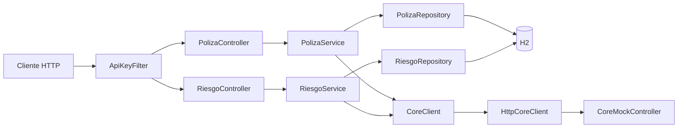

# 🛡️ API de Gestión de Pólizas de Arrendamiento

**Autor:** Juan Sierra  
**Prueba técnica:** Desarrollador TI / Sénior  
**Organización:** Seguros Bolívar  
**Tecnologías principales:** Java 17 · Spring Boot 4.1 · Spring Data JPA · H2 · Maven

API REST desarrollada para gestionar pólizas de arrendamiento individuales y colectivas, junto con los riesgos asociados a cada una. La aplicación permite consultar y filtrar pólizas, consultar riesgos, renovar pólizas aplicando el porcentaje de IPC correspondiente, recalcular el canon mensual, la prima y el nuevo periodo de vigencia, cancelar pólizas y sus riesgos activos, agregar riesgos a pólizas colectivas y cancelar riesgos de manera individual.

Las operaciones que modifican pólizas o riesgos se informan previamente a un CORE de seguros simulado mediante una integración HTTP, de modo que la base de datos local solo se actualiza después de recibir una respuesta exitosa.

La solución implementa reglas de negocio, validación de datos de entrada, seguridad mediante la cabecera `x-api-key`, persistencia con Spring Data JPA y H2, manejo centralizado de errores, control de concurrencia optimista, separación modular por capas y pruebas automatizadas con JUnit, Mockito y MockMvc.


---

## 📑 Índice

1. [Descripción del proyecto](#-1-descripción-del-proyecto)
2. [Instalación y ejecución](#-2-instalación-y-ejecución)
3. [Arquitectura de la solución](#-3-arquitectura-de-la-solución)
4. [Estructura del proyecto](#-4-estructura-del-proyecto)
5. [Modelo y carga de datos](#-5-modelo-y-carga-de-datos)
6. [Configuración y seguridad](#-6-configuración-y-seguridad)
7. [Endpoints y pruebas manuales](#-7-endpoints-y-pruebas-manuales)
8. [Reglas de negocio](#-8-reglas-de-negocio)
9. [Integración con el CORE](#-9-integración-con-el-core)
10. [Manejo de errores](#-10-manejo-de-errores)
11. [Pruebas automatizadas](#-11-pruebas-automatizadas)

---

## 🎯 1. Descripción del proyecto

La aplicación permite:

- Consultar pólizas por tipo y estado.
- Consultar los riesgos asociados a una póliza.
- Renovar pólizas aplicando un porcentaje de IPC.
- Recalcular el canon mensual, la prima y la vigencia.
- Cancelar pólizas junto con sus riesgos activos.
- Agregar riesgos a pólizas colectivas.
- Cancelar riesgos individualmente.
- Informar las operaciones de modificación a un CORE simulado.
- Proteger los endpoints mediante la cabecera `x-api-key`.
- Validar reglas de negocio y datos de entrada.

### Tipos de póliza

| Tipo | Descripción |
|---|---|
| `INDIVIDUAL` | Tiene un único riesgo asociado |
| `COLECTIVA` | Puede tener uno o varios riesgos asociados |

### Estados utilizados

```text
Póliza: ACTIVA, RENOVADA, CANCELADA
Riesgo: ACTIVO, CANCELADO
```

---

## 🚀 2. Instalación y ejecución

### 2.1 Requisitos

- Java 17 o superior.
- Git, únicamente si se va a clonar el repositorio.
- `curl`, Postman o cualquier cliente HTTP.

No es necesario instalar Maven porque el proyecto incluye Maven Wrapper.

Verificar Java:

```bash
java -version
```

### 2.2 Clonar el repositorio

```bash
git clone <URL_DEL_REPOSITORIO>
cd gestion-polizas
```

### 2.3 Compilar y ejecutar las pruebas

Windows:

```powershell
.\mvnw.cmd clean test
```

Linux o macOS:

```bash
./mvnw clean test
```

Resultado esperado:

```text
BUILD SUCCESS
```

### 2.4 Iniciar la aplicación

Windows:

```powershell
.\mvnw.cmd spring-boot:run
```

Linux o macOS:

```bash
./mvnw spring-boot:run
```

La aplicación quedará disponible en:

```text
http://localhost:8080
```

### 2.5 Verificación rápida

```bash
curl --location 'http://localhost:8080/polizas' \
--header 'x-api-key: 123456'
```

Resultado esperado:

```http
200 OK
```

La respuesta debe contener las tres pólizas cargadas inicialmente.

---

## 🏗️ 3. Arquitectura de la solución

### 3.1 Arquitectura diseñada

La arquitectura de alto nivel propuesta para una implementación empresarial está orientada a microservicios:

```text
API Gateway
    ├── Servicio de Pólizas
    ├── Servicio de Riesgos
    ├── Servicio de Notificaciones
    └── Adaptador de Integración con el CORE
```

Este diseño permite:

- Escalar cada servicio de manera independiente.
- Desplegar componentes por separado.
- Aislar fallos.
- Desacoplar la lógica de negocio del CORE.
- Procesar notificaciones de forma asíncrona.
- Centralizar seguridad y control de tráfico en el API Gateway.

### 3.2 Implementación práctica: monolito modular

Aunque la arquitectura empresarial está basada en microservicios, para efectos prácticos de la prueba se implementó un **monolito modular con Spring Boot**.

Esta decisión se tomó porque:

- El módulo práctico solicita implementar únicamente los componentes esenciales.
- El tiempo sugerido para el ejercicio es limitado.
- No se requiere desplegar infraestructura distribuida.
- Facilita la ejecución y evaluación local.
- Evita crear varios servicios, redes y despliegues sin aportar valor funcional al ejercicio.
- Mantiene separadas las responsabilidades y permite dividir posteriormente la aplicación en servicios independientes.



### 3.3 Operaciones de consulta

Las consultas no modifican información y no llaman al CORE:

| Endpoint | Recurso consultado |
|---|---|
| `GET /polizas` | Pólizas |
| `GET /polizas/{id}/riesgos` | Riesgos asociados a una póliza |

Flujo:

```text
Cliente
   ↓
ApiKeyFilter
   ↓
Controller
   ↓
Service
   ↓
Repository
   ↓
H2
   ↓
Respuesta
```

### 3.4 Operaciones de modificación

Se consideran operaciones de modificación aquellas que cambian el estado o la información de una póliza o un riesgo.

| Operación | Endpoint | Recurso afectado | Operación enviada al CORE |
|---|---|---|---|
| Renovar una póliza | `POST /polizas/{id}/renovar` | Póliza | `RENOVAR_POLIZA` |
| Cancelar una póliza | `POST /polizas/{id}/cancelar` | Póliza y sus riesgos activos | `CANCELAR_POLIZA` |
| Agregar un riesgo | `POST /polizas/{id}/riesgos` | Nuevo riesgo de una póliza colectiva | `AGREGAR_RIESGO` |
| Cancelar un riesgo | `POST /riesgos/{id}/cancelar` | Riesgo | `CANCELAR_RIESGO` |

Flujo general:

```text
Cliente
   ↓
ApiKeyFilter valida x-api-key
   ↓
Controller recibe la solicitud
   ↓
Service consulta el recurso
   ↓
Service valida las reglas de negocio
   ↓
CoreClient envía la operación al CORE mock
   ↓
CORE mock responde correctamente
   ↓
Service modifica la información local
   ↓
Repository persiste los cambios en H2
   ↓
Se confirma la transacción
   ↓
La API retorna la respuesta
```

Si el CORE confirma:

```text
CORE confirma la operación
        ↓
Se guarda el cambio local
```

Si el CORE falla:

```text
CORE no responde o devuelve un error
        ↓
CoreIntegrationException
        ↓
No se confirma el cambio local
        ↓
503 Service Unavailable
```

#### Renovación de una póliza

```text
1. Buscar la póliza.
2. Validar que no esté cancelada.
3. Validar que el IPC sea mayor que cero.
4. Calcular el nuevo canon.
5. Calcular la nueva prima.
6. Calcular las nuevas fechas de vigencia.
7. Enviar RENOVAR_POLIZA al CORE.
8. Cambiar el estado a RENOVADA.
9. Actualizar canon, prima y fechas.
10. Guardar la póliza.
```

Información local modificada:

```text
POLIZAS.estado
POLIZAS.fecha_inicio
POLIZAS.fecha_fin
POLIZAS.canon_mensual
POLIZAS.prima
POLIZAS.version
```

#### Cancelación de una póliza

```text
1. Buscar la póliza.
2. Verificar si ya está cancelada.
3. Enviar CANCELAR_POLIZA al CORE.
4. Cambiar la póliza a CANCELADA.
5. Registrar su fecha de cancelación.
6. Buscar sus riesgos activos.
7. Cambiar los riesgos a CANCELADO.
8. Registrar la fecha de cancelación de cada riesgo.
9. Guardar todos los cambios.
```

Información local modificada:

```text
POLIZAS.estado
POLIZAS.fecha_cancelacion
RIESGOS.estado
RIESGOS.fecha_cancelacion
```

#### Adición de un riesgo

```text
1. Buscar la póliza.
2. Validar que sea COLECTIVA.
3. Validar que no esté cancelada.
4. Validar los datos del nuevo riesgo.
5. Enviar AGREGAR_RIESGO al CORE.
6. Crear el riesgo en estado ACTIVO.
7. Asociarlo con la póliza.
8. Guardarlo en RIESGOS.
```

En esta operación se inserta un nuevo registro en `RIESGOS`.

El `riesgoId` enviado al CORE es `null` porque el identificador local todavía no ha sido generado.

#### Cancelación de un riesgo

```text
1. Buscar el riesgo.
2. Verificar si ya está cancelado.
3. Obtener la póliza asociada.
4. Enviar CANCELAR_RIESGO al CORE.
5. Cambiar el riesgo a CANCELADO.
6. Registrar su fecha de cancelación.
7. Guardar el riesgo.
```

Información local modificada:

```text
RIESGOS.estado
RIESGOS.fecha_cancelacion
RIESGOS.version
```

### 3.5 Tecnologías utilizadas

| Tecnología | Uso |
|---|---|
| Java 17 | Lenguaje principal |
| Spring Boot 4.1 | Configuración y ejecución |
| Spring Web MVC | Endpoints REST |
| Spring Data JPA | Acceso a datos |
| Spring Validation | Validación de solicitudes |
| Spring RestClient | Comunicación HTTP con el CORE mock |
| H2 | Base de datos en memoria |
| Lombok | Reducción de código repetitivo |
| Maven | Compilación y dependencias |
| JUnit | Pruebas automatizadas |
| Mockito | Simulación del cliente CORE |
| MockMvc | Pruebas de endpoints y filtros |

---

## 📦 4. Estructura del proyecto

```text
src
├── main
│   ├── java
│   │   └── com/juansierrasegurosbolivar/gestionpolizas
│   │       ├── controller
│   │       │   ├── PolizaController.java
│   │       │   ├── RiesgoController.java
│   │       │   └── CoreMockController.java
│   │       ├── dto
│   │       │   ├── request
│   │       │   └── response
│   │       ├── entity
│   │       │   └── enums
│   │       ├── exception
│   │       ├── integration
│   │       │   └── impl
│   │       ├── mapper
│   │       ├── repository
│   │       ├── security
│   │       ├── service
│   │       │   └── impl
│   │       └── GestionPolizasApplication.java
│   └── resources
│       ├── application.yml
│       └── data.sql
└── test
    └── java
        └── com/juansierrasegurosbolivar/gestionpolizas
```

### Responsabilidad de cada módulo

| Módulo | Responsabilidad |
|---|---|
| `controller` | Exponer los endpoints REST |
| `service` | Ejecutar casos de uso y reglas de negocio |
| `repository` | Consultar y persistir información |
| `entity` | Representar pólizas y riesgos |
| `dto` | Definir solicitudes y respuestas |
| `mapper` | Convertir entidades en DTO |
| `integration` | Comunicar la aplicación con el CORE |
| `security` | Validar la cabecera `x-api-key` |
| `exception` | Centralizar el manejo de errores |

---

## 🗄️ 5. Modelo y carga de datos

### 5.1 Modelo diseñado para la arquitectura empresarial

El modelo principal diseñado contempla:

```text
PARTICIPANTE
POLIZA
POLIZA_PARTICIPANTE
RIESGO
RENOVACION
```

Este modelo permitiría administrar:

- Tomadores.
- Asegurados.
- Beneficiarios.
- Relaciones entre participantes y pólizas.
- Historial de renovaciones.
- IPC aplicado en cada renovación.
- Valores anteriores y nuevos de canon y prima.

### 5.2 Modelo implementado en el ejercicio

Para el módulo práctico se implementaron únicamente:

```text
POLIZAS
RIESGOS
```

Estas dos tablas son suficientes para:

- Consultar pólizas.
- Renovar y cancelar pólizas.
- Consultar, agregar y cancelar riesgos.
- Validar las reglas solicitadas.

No se implementaron las tablas de participantes ni renovaciones porque ninguna de las operaciones requeridas administra esos recursos directamente.

### 5.3 Base de datos utilizada

La aplicación utiliza H2 en memoria:

```text
JDBC URL: jdbc:h2:mem:polizasdb
Usuario: sa
Contraseña: vacía
```

Consola:

```text
http://localhost:8080/h2-console
```

Las tablas se generan desde las entidades JPA.

Los datos iniciales se cargan desde:

```text
src/main/resources/data.sql
```

H2 se utilizó porque:

- No requiere instalar un motor externo.
- Facilita la ejecución local.
- Permite restaurar rápidamente el escenario de prueba.
- Es suficiente para demostrar la persistencia solicitada.
- Permite ejecutar pruebas sin dependencias externas.

### 5.4 Datos cargados en `POLIZAS`

El script carga **3 registros** en la tabla `POLIZAS`.

| ID esperado | Tipo | Estado | Fecha inicial | Fecha final | Meses | Canon mensual | Prima |
|---:|---|---|---|---|---:|---:|---:|
| 1 | `INDIVIDUAL` | `ACTIVA` | 2026-01-01 | 2026-12-31 | 12 | 1.500.000 | 18.000.000 |
| 2 | `COLECTIVA` | `ACTIVA` | 2026-02-01 | 2027-01-31 | 12 | 2.500.000 | 30.000.000 |
| 3 | `INDIVIDUAL` | `CANCELADA` | 2026-03-01 | 2027-02-28 | 12 | 1.200.000 | 14.400.000 |

La tercera póliza tiene fecha de cancelación:

```text
2026-06-15 10:30:00
```

Estos registros permiten probar:

- Consultas por tipo y estado.
- Renovación de una póliza activa.
- Restricción de renovación de una póliza cancelada.
- Cancelación de una póliza colectiva.

### 5.5 Datos cargados en `RIESGOS`

El script carga **4 registros** en la tabla `RIESGOS`.

| ID esperado | Póliza asociada | Descripción | Estado |
|---:|---|---|---|
| 1 | Póliza individual activa | Apartamento de uso residencial | `ACTIVO` |
| 2 | Póliza colectiva activa | Local comercial 101 | `ACTIVO` |
| 3 | Póliza colectiva activa | Local comercial 102 | `ACTIVO` |
| 4 | Póliza individual cancelada | Casa de uso residencial | `CANCELADO` |

Estos registros permiten probar:

- Una póliza individual con un solo riesgo.
- Una póliza colectiva con varios riesgos.
- La creación de riesgos adicionales.
- La cancelación individual de un riesgo.
- La cancelación en cascada.
- La consulta de riesgos activos y cancelados.

### 5.6 Reinicio de los datos

H2 está configurada como base en memoria:

```text
Detener la aplicación
        ↓
Se elimina la base de datos
        ↓
Iniciar nuevamente
        ↓
Hibernate crea las tablas
        ↓
data.sql carga 3 pólizas y 4 riesgos
```

Los identificadores mostrados corresponden a una ejecución limpia y pueden variar si se modifica el script o la estrategia de generación.

Consultas útiles:

```sql
SELECT * FROM POLIZAS ORDER BY ID;
```

```sql
SELECT * FROM RIESGOS ORDER BY ID;
```

Consulta conjunta:

```sql
SELECT
    p.id AS poliza_id,
    p.tipo,
    p.estado AS estado_poliza,
    r.id AS riesgo_id,
    r.descripcion,
    r.estado AS estado_riesgo
FROM polizas p
LEFT JOIN riesgos r
    ON r.poliza_id = p.id
ORDER BY p.id, r.id;
```

---

## 🔐 6. Configuración y seguridad

La configuración se encuentra en:

```text
src/main/resources/application.yml
```

### Variables admitidas

| Variable | Valor predeterminado | Descripción |
|---|---|---|
| `API_KEY` | `123456` | Clave requerida para consumir la API |
| `CORE_BASE_URL` | `http://localhost:8080` | URL base del CORE |

Ejemplo:

```powershell
$env:API_KEY = "123456"
$env:CORE_BASE_URL = "http://localhost:8080"
.\mvnw.cmd spring-boot:run
```

Todos los endpoints requieren:

```http
x-api-key: 123456
```

Solicitud válida:

```bash
curl --location 'http://localhost:8080/polizas' \
--header 'x-api-key: 123456'
```

Solicitud sin API key:

```bash
curl --location 'http://localhost:8080/polizas'
```

Resultado:

```http
401 Unauthorized
```

Respuesta:

```json
{
  "status": 401,
  "error": "Unauthorized",
  "message": "La API key es inválida o no fue enviada",
  "path": "/polizas"
}
```

El filtro no se aplica a:

```text
/h2-console/**
/error
```

Esto permite abrir la consola H2 y evita interferir con el procesamiento interno de errores.

---

## 🌐 7. Endpoints y pruebas manuales

Los siguientes comandos usan cURL estándar y pueden importarse directamente en Postman.

### Importar un comando en Postman

1. Abrir Postman.
2. Seleccionar **Import**.
3. Elegir **Raw text**.
4. Pegar el comando cURL.
5. Seleccionar **Continue**.
6. Seleccionar **Import**.

Postman configurará automáticamente:

- Método HTTP.
- URL.
- Cabeceras.
- Cuerpo JSON.

> Las operaciones `POST` modifican la base H2. Para repetir todas las pruebas desde el escenario inicial, reinicie la aplicación.

### Resumen

| Método | Endpoint | Descripción |
|---|---|---|
| `GET` | `/polizas` | Consultar y filtrar pólizas |
| `GET` | `/polizas/{id}/riesgos` | Consultar riesgos de una póliza |
| `POST` | `/polizas/{id}/renovar` | Renovar una póliza |
| `POST` | `/polizas/{id}/cancelar` | Cancelar una póliza y sus riesgos |
| `POST` | `/polizas/{id}/riesgos` | Agregar un riesgo |
| `POST` | `/riesgos/{id}/cancelar` | Cancelar un riesgo |
| `POST` | `/core-mock/evento` | Probar directamente el CORE mock |

### 7.1 Consultar todas las pólizas

```bash
curl --location 'http://localhost:8080/polizas' \
--header 'x-api-key: 123456'
```

Resultado esperado:

```http
200 OK
```

Debe retornar 3 pólizas en una ejecución limpia.

### 7.2 Consultar pólizas por tipo

```bash
curl --location 'http://localhost:8080/polizas?tipo=COLECTIVA' \
--header 'x-api-key: 123456'
```

### 7.3 Consultar pólizas por tipo y estado

```bash
curl --location 'http://localhost:8080/polizas?tipo=COLECTIVA&estado=ACTIVA' \
--header 'x-api-key: 123456'
```

Valores permitidos:

```text
tipo: INDIVIDUAL, COLECTIVA
estado: ACTIVA, RENOVADA, CANCELADA
```

### 7.4 Consultar los riesgos de una póliza

```bash
curl --location 'http://localhost:8080/polizas/2/riesgos' \
--header 'x-api-key: 123456'
```

Con los datos iniciales, la póliza `2` debe retornar 2 riesgos activos.

### 7.5 Renovar una póliza activa

```bash
curl --location --request POST 'http://localhost:8080/polizas/1/renovar' \
--header 'x-api-key: 123456' \
--header 'Content-Type: application/json' \
--data-raw '{
  "ipcPorcentaje": 10
}'
```

Resultado esperado:

```http
200 OK
```

Con los datos iniciales:

```text
Canon anterior: 1.500.000
IPC aplicado:   10 %
Canon nuevo:    1.650.000
Prima nueva:    19.800.000
Nueva vigencia: 2027-01-01 a 2027-12-31
Nuevo estado:   RENOVADA
```

Log esperado:

```text
CORE MOCK - operación=RENOVAR_POLIZA, polizaId=1, riesgoId=null
```

### 7.6 Intentar renovar una póliza cancelada

```bash
curl --location --request POST 'http://localhost:8080/polizas/3/renovar' \
--header 'x-api-key: 123456' \
--header 'Content-Type: application/json' \
--data-raw '{
  "ipcPorcentaje": 10
}'
```

Resultado esperado:

```http
422 Unprocessable Content
```

Esta prueba verifica que una póliza cancelada no pueda renovarse.

### 7.7 Agregar un riesgo a una póliza colectiva

```bash
curl --location --request POST 'http://localhost:8080/polizas/2/riesgos' \
--header 'x-api-key: 123456' \
--header 'Content-Type: application/json' \
--data-raw '{
  "descripcion": "Bodega de almacenamiento",
  "direccionInmueble": "Avenida 68 # 20-50, Bogotá"
}'
```

Resultado esperado:

```http
201 Created
```

Debe insertarse un riesgo con:

```text
estado = ACTIVO
poliza_id = 2
```

### 7.8 Intentar agregar un riesgo a una póliza individual

```bash
curl --location --request POST 'http://localhost:8080/polizas/1/riesgos' \
--header 'x-api-key: 123456' \
--header 'Content-Type: application/json' \
--data-raw '{
  "descripcion": "Riesgo adicional",
  "direccionInmueble": "Calle 20 # 30-40, Bogotá"
}'
```

Resultado esperado:

```http
422 Unprocessable Content
```

Esta prueba verifica que una póliza individual no admita riesgos adicionales.

### 7.9 Cancelar un riesgo

Consultar primero los riesgos:

```bash
curl --location 'http://localhost:8080/polizas/2/riesgos' \
--header 'x-api-key: 123456'
```

Cancelar uno:

```bash
curl --location --request POST 'http://localhost:8080/riesgos/2/cancelar' \
--header 'x-api-key: 123456'
```

Resultado esperado:

```http
200 OK
```

El riesgo debe quedar con:

```text
estado = CANCELADO
fechaCancelacion != null
```

### 7.10 Cancelar una póliza y sus riesgos

Para ejecutar esta prueba con los datos iniciales, reinicie primero la aplicación.

```bash
curl --location --request POST 'http://localhost:8080/polizas/2/cancelar' \
--header 'x-api-key: 123456'
```

Resultado esperado:

```http
200 OK
```

Después:

```bash
curl --location 'http://localhost:8080/polizas/2/riesgos' \
--header 'x-api-key: 123456'
```

Debe verificarse:

- Póliza `2` en estado `CANCELADA`.
- Todos sus riesgos en estado `CANCELADO`.
- Fechas de cancelación registradas.

### 7.11 Probar directamente el CORE mock

```bash
curl --location --request POST 'http://localhost:8080/core-mock/evento' \
--header 'x-api-key: 123456' \
--header 'Content-Type: application/json' \
--data-raw '{
  "operacion": "RENOVAR_POLIZA",
  "polizaId": 1,
  "riesgoId": null
}'
```

Resultado esperado:

```http
204 No Content
```

Log esperado:

```text
CORE MOCK - operación=RENOVAR_POLIZA, polizaId=1, riesgoId=null
```

Operaciones admitidas:

```text
RENOVAR_POLIZA
CANCELAR_POLIZA
AGREGAR_RIESGO
CANCELAR_RIESGO
```

### 7.12 Solicitud sin API key

```bash
curl --location 'http://localhost:8080/polizas'
```

Resultado esperado:

```http
401 Unauthorized
```

### 7.13 Solicitud con API key incorrecta

```bash
curl --location 'http://localhost:8080/polizas' \
--header 'x-api-key: clave-incorrecta'
```

Resultado esperado:

```http
401 Unauthorized
```

### 7.14 Consultar una póliza inexistente

```bash
curl --location 'http://localhost:8080/polizas/999999/riesgos' \
--header 'x-api-key: 123456'
```

Resultado esperado:

```http
404 Not Found
```

---

## 📋 8. Reglas de negocio

- Una póliza individual tiene como máximo un riesgo.
- Solo se pueden agregar riesgos a pólizas colectivas.
- No se pueden agregar riesgos a una póliza cancelada.
- Una póliza cancelada no puede renovarse.
- Cancelar una póliza cancela todos sus riesgos activos.
- La renovación aplica el porcentaje de IPC al canon mensual.
- La prima se recalcula con el canon y los meses de vigencia.
- La renovación conserva la cantidad inicial de meses.
- El nuevo periodo comienza después de finalizar el periodo anterior.
- El estado posterior a la renovación es `RENOVADA`.
- Las modificaciones se informan al CORE antes de guardarse localmente.
- Si el CORE falla, el cambio local no se confirma.

Los valores monetarios utilizan `BigDecimal` para evitar errores de precisión.

Las entidades utilizan `@Version` para detectar actualizaciones concurrentes mediante bloqueo optimista.

---

## 🔌 9. Integración con el CORE

La integración solo se utiliza en operaciones que modifican pólizas o riesgos:

```text
RENOVAR_POLIZA
CANCELAR_POLIZA
AGREGAR_RIESGO
CANCELAR_RIESGO
```

Las consultas no llaman al CORE.

### Componentes

```text
PolizaServiceImpl / RiesgoServiceImpl
               ↓
           CoreClient
               ↓
        HttpCoreClient
               ↓ HTTP
   POST /core-mock/evento
               ↓
     CoreMockController
```

| Componente | Responsabilidad |
|---|---|
| `CoreClient` | Define el contrato de integración |
| `HttpCoreClient` | Ejecuta la petición HTTP |
| `CoreMockController` | Simula la recepción de la operación |
| `CoreIntegrationException` | Representa una falla de comunicación |

Ejemplo de renovación:

```json
{
  "operacion": "RENOVAR_POLIZA",
  "polizaId": 1,
  "riesgoId": null
}
```

Ejemplo de cancelación de riesgo:

```json
{
  "operacion": "CANCELAR_RIESGO",
  "polizaId": 2,
  "riesgoId": 3
}
```

La URL se configura mediante:

```yaml
app:
  core:
    base-url: ${CORE_BASE_URL:http://localhost:8080}
```

Aunque el mock se encuentra dentro de la misma aplicación para facilitar la ejecución, se consume mediante HTTP para representar una integración externa.

---

## 🚨 10. Manejo de errores

La aplicación centraliza los errores mediante `GlobalExceptionHandler`.

| Código | Situación |
|---:|---|
| `400` | JSON inválido, parámetros incorrectos o campos no válidos |
| `401` | API key ausente o incorrecta |
| `404` | Póliza o riesgo inexistente |
| `409` | Actualización concurrente |
| `422` | Incumplimiento de una regla de negocio |
| `503` | Fallo de comunicación con el CORE |
| `500` | Error interno inesperado |

Ejemplo:

```json
{
  "timestamp": "2026-08-03T10:30:00",
  "status": 422,
  "error": "Unprocessable Content",
  "message": "No se puede renovar una póliza cancelada",
  "path": "/polizas/3/renovar",
  "detalles": {}
}
```

---

## 🧪 11. Pruebas automatizadas

Ejecutar:

```powershell
.\mvnw.cmd clean test
```

Las pruebas utilizan:

- Spring Boot Test.
- MockMvc.
- JUnit.
- Mockito.
- H2.

### Cobertura funcional

| Prueba | Propósito |
|---|---|
| API key ausente | Verificar que se rechacen solicitudes no autenticadas |
| API key incorrecta | Verificar que no se acepten claves inválidas |
| Consulta de pólizas | Confirmar la recuperación de los registros iniciales |
| Filtros de pólizas | Validar filtros por tipo y estado |
| Parámetros inválidos | Confirmar respuestas `400` |
| Consulta de riesgos | Validar la relación entre pólizas y riesgos |
| Renovación | Verificar IPC, canon, prima, fechas y estado |
| Renovación cancelada | Impedir renovar una póliza cancelada |
| Creación de riesgos | Permitir riesgos en pólizas colectivas |
| Riesgo en individual | Impedir agregar riesgos a una póliza individual |
| Cancelación de riesgo | Cambiar estado y registrar fecha de cancelación |
| Cancelación en cascada | Cancelar todos los riesgos al cancelar la póliza |
| Recurso inexistente | Confirmar respuestas `404` |
| Integración CORE | Verificar que los servicios invoquen `CoreClient` |

Durante las pruebas automatizadas, `CoreClient` se reemplaza por un mock de Mockito:

```text
Service
   ↓
CoreClient simulado
```

Esto permite comprobar que la operación fue enviada al CORE sin depender de:

- Un servidor externo.
- Un puerto disponible.
- Conectividad de red.
- WebLogic.
- Un CORE real.

Las pruebas transaccionales revierten sus cambios al finalizar para evitar que una prueba afecte a las siguientes.
